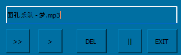
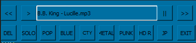

# This Tools Have three functions
1. **Playing with specific style folder, decide song classicify to which style. or just delete. This mode just playing one by one.**
2. **Playing songs by random mode or one by one. playing all the songs. and deciced classicify to which style or delete.**
3. **Just Playing the songs.**

*******
# Explanation
1. **RandomForm.py** is used for random mode
2. **ListForm.py** is used for one by one specific style.
3. **config.ini**   Record media path. specific style folder name.
   - folder_index
     - chose which style index
	- config_folder
		- generated temp files will save here. include which song need move to which style, which song need to delete.
4. **config_modules.ini** used for RandomForm. decide play only or random mode
5. **MusicHandleAfter.py** from **config_folder** read info, and move the songs to it specified. or delete songs not need, that all recorded in the **config_folder**
***
# Potential Function
- **also you can delete songs, compare to a existing list file. like music.txt**. however, this function sometimes need to suit path, so is not easy if you do not understand the code.
***
# UI
- **Random Mode**

- **Classify Mode**

